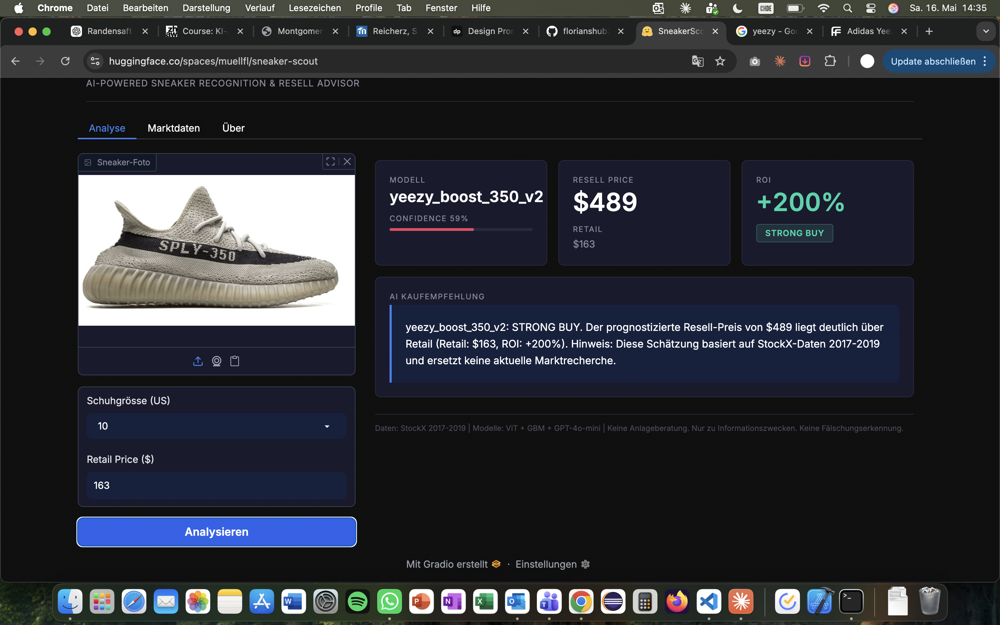

# SneakerScout

AI-powered sneaker recognition and resell price advisor combining computer vision, numeric ML, and prompt-engineered LLMs.

## What it does

Upload a sneaker photo → the system recognises the model, predicts a fair resell price, and returns a data-grounded buy/hold/sell recommendation.

```
Image ─► CV (ViT) ─► Model + Confidence
                          │
                          ▼
       Retail / Size ─► ML (GBM) ─► Predicted Resell Price + ROI
                                          │
                                          ▼
                       Market Knowledge ─► NLP (GPT-4o-mini) ─► Recommendation
```

## Tech Stack

| Block | Technology |
|---|---|
| Computer Vision | HuggingFace Transformers, ViT (`google/vit-base-patch16-224`), ResNet50 comparison |
| Numeric ML | scikit-learn, XGBoost |
| NLP | OpenAI GPT-4o-mini, three prompt variants |
| App | Gradio 5 |
| Deployment | HuggingFace Spaces |

## Quick Start

```bash
# 1. Install dependencies
pip install -r requirements.txt

# 2. Download datasets (see data/raw/README.md)
# Kaggle: nikolasgegenava/sneakers-classification
# Kaggle: hudsonstuck/stockx-data-contest
# Kaggle: rkiattisak/shoe-prices-dataset

# 3. Run notebooks in order
jupyter notebook notebooks/

# 4. Launch the app locally
export OPENAI_API_KEY="sk-..."
python app/app.py
# Open http://localhost:7860
```

## Project Structure

```
sneaker-scout/
├── data/
│   ├── raw/                  # downloaded datasets (not tracked)
│   ├── processed/            # cleaned splits
│   └── knowledge_base/       # sneaker market context (NLP)
├── notebooks/
│   ├── 01_eda_stockx.ipynb
│   ├── 02_cv_training.ipynb
│   ├── 03_ml_training.ipynb
│   ├── 04_nlp_evaluation.ipynb
│   └── 05_ethics_and_bias.ipynb
├── src/
│   ├── cv_model.py           # ViT inference
│   ├── ml_model.py           # price predictor inference
│   ├── nlp_advisor.py        # LLM recommendation
│   ├── preprocessing.py      # shared utils
│   └── config.py             # paths, constants
├── app/
│   ├── app.py                # Gradio entry point
│   └── requirements.txt
├── models/                   # trained artifacts (not tracked)
├── tests/
└── documentation.md          # project documentation (course template)
```

## Notebooks

| Notebook | Purpose |
|---|---|
| `01_eda_stockx.ipynb` | EDA + feature engineering + train/val/test split |
| `02_cv_training.ipynb` | ViT fine-tuning + ResNet50 comparison + per-class evaluation |
| `03_ml_training.ipynb` | Ridge / RF / GBM comparison + hyperparameter tuning + residuals |
| `04_nlp_evaluation.ipynb` | Three prompt variants + rubric-based comparison |
| `05_ethics_and_bias.ipynb` | Data bias, ML bias, CV fairness, socioeconomic considerations |

## Tests

```bash
pytest tests/ -q
```

## Live Demo

App: https://huggingface.co/spaces/muellfl/sneaker-scout
Fine-tuned CV model: https://huggingface.co/muellfl/sneaker-scout-vit



Additional screenshots (low-confidence picker, market data, about tab) are in [`assets/screenshots/`](assets/screenshots/) and are referenced in [`documentation.md`](documentation.md) Section 3.

## Documentation

Full project documentation: [`documentation.md`](documentation.md)

## License

Academic project, ZHAW AI Applications FS2026.
